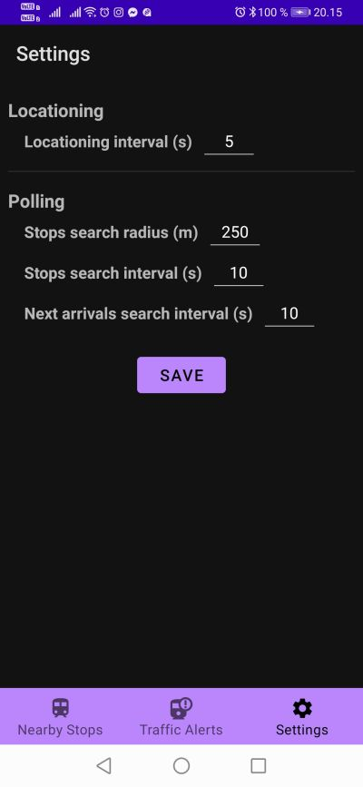
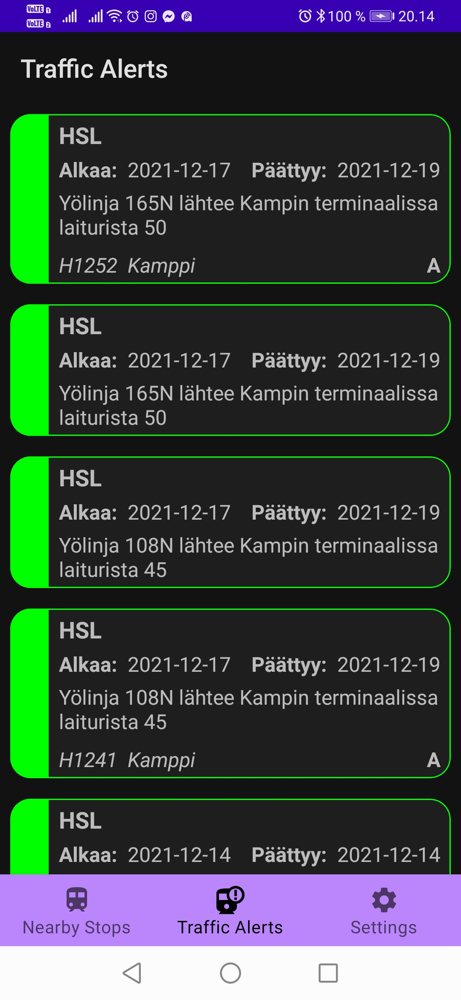
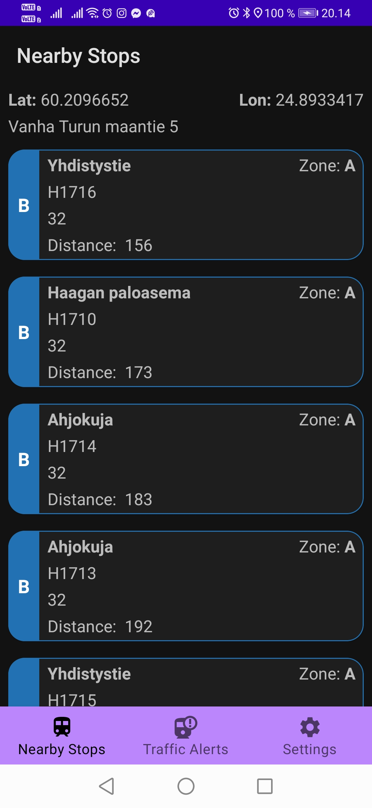
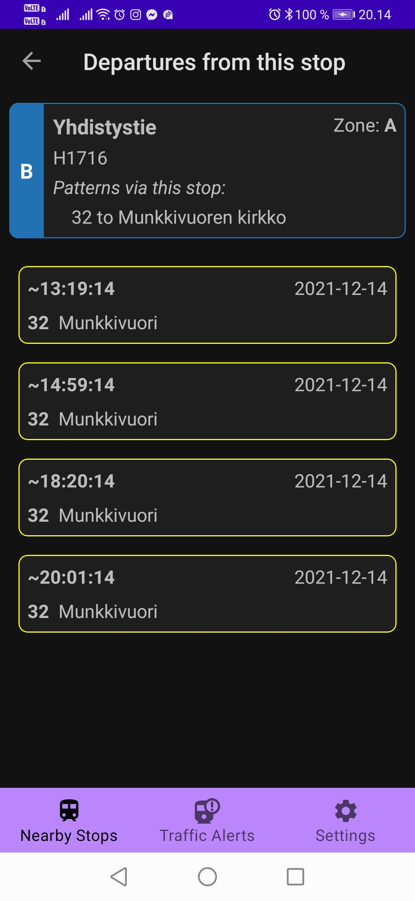

# DigiTransit

This is an app for querying the DigiTransit GraphQL API in Finland and having some fun with it.

First of all, let me refer you to a YouTube channel AndroidFactory, which has immensely helped me in my work:
https://www.youtube.com/channel/UCafJ0J81ELiYJgJyd-yqrpQ

Please check it out, as it is a vast source of modern Android stuff, and the videos are extremely well laid out!

## Note

This currently works only in Finland, but some other cities in Europe have also implemented the DigiTransit as their public transport API. Check out for them.
Basically, if you're in a country which implements the DigiTransit API, in the simplest case, all you have to do is to change the GraphQL API query endpoint
(which in this application is https://api.digitransit.fi/routing/v1/routers/finland/index/graphql )

## The Application

In general, the app follows the MVVM architecture (in the picture, Retrofit is replaced by GraphQL).

The app locates you (or your mobile, of course) and polls for all public transport stops near you.  The locationing interval (in seconds) and search radius
(in meters) are set in the Settings tab.  Also the stop polling delay and the departures polling delay (in seconds) can be set by the user.

When selecting a particular stop from the list of nearby stops returned from the query, the app opens a new fragment to poll&show the next departures
from that particular stop.

The app also shows all traffic alerts, grouped by the Feed of the alert, that is, by the area / public transport agency which has published this alert.
Usually, these feeds refer to particular towns in the area of the country's public transport system.

Currently, the feeds in Finland seem to be HSL (Helsinki public transport), OULU (Oulu public transport) and tampere (Tampere public transport), but the app
shows any and all additional alerts that might subscribe to the alert system in future.

## Stops view

The StopsFragment shows for all nearby stops the following information:
- stop name
- stop code (in Helsinki area, the code that's printed on the stop sign)
- zone (related to the fare policy of a trip on some parts of Finland public transport)
- patterns that use this stop
- distance (in meters) to the stop

Stop card symbol and colour are chosen based on whether the Stop is recognized as being a bus, tram, metro, train etc. stop. In Helsinki (HSL) area, this is very
thoroughly implemented. In other areas, the Stop card is shown as gray, indicating that the Stop has not implemented the Type property yet.

## Departures view

The DeparturesFragment shows more information on the Stop selected (for example all Patterns using this Stop), in addition with the information of the next
departures from this Stop.

For each Departure, the following information is shown:
- date of departure
- time until departure. When preceded with a "~", the time is an estimate, based on fixed timetables
- headsign of the transportation vehicle departing from the Stop

Note that when the departure from this stop is based on an estimate, the corresponding item is shown in yellow. With realtime estimate it is shown in green.
